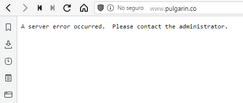

# El juego de la vida. Una reescritura en vainilla javascript.

# Tabla de contenidos
- [El juego de la vida. Una reescritura en vainilla javascript.](#el-juego-de-la-vida-una-reescritura-en-vainilla-javascript)
- [Tabla de contenidos](#tabla-de-contenidos)
- [Introducción](#introducción)
  - [Justificación del trabajo](#justificación-del-trabajo)
  - [Contexto y estado del arte](#contexto-y-estado-del-arte)
    - [Pulgarin.co](#pulgarinco)
    - [pmav.eu](#pmaveu)
    - [javascript.plainenglish.io](#javascriptplainenglishio)
- [Desarrollo](#desarrollo)
  - [Análisis de la situación](#análisis-de-la-situación)
  - [Inicialización de un proyecto con npm init](#inicialización-de-un-proyecto-con-npm-init)
  - [Uso de clases en JavaScript](#uso-de-clases-en-javascript)
  - [Implementación de un sistema de inicialización](#implementación-de-un-sistema-de-inicialización)
  - [Implementación de un sistema de dibujado](#implementación-de-un-sistema-de-dibujado)
  - [Implantación de un sistema de funciones publicas](#implantación-de-un-sistema-de-funciones-publicas)
  - [Uso de comentarios para jsdoc](#uso-de-comentarios-para-jsdoc)
  - [Compilando en JSDoc](#compilando-en-jsdoc)
  - [Service workers y PWA](#service-workers-y-pwa)
    - [usos de pwa y app cache para trabajo offline](#usos-de-pwa-y-app-cache-para-trabajo-offline)
  - [Web responsiva](#web-responsiva)
  - [hosting http y https](#hosting-http-y-https)
  - [Readme.md y otros archivos de documentación](#readmemd-y-otros-archivos-de-documentación)
- [Conclusiones y trabajos futuros](#conclusiones-y-trabajos-futuros)
- [Bibliografía/webgrafía](#bibliografíawebgrafía)

# Introducción

Hace mucho tiempo, antes de intentar tomarme en serio la programación, publique [un post en mi blog sobre el juego de la vida](https://interlan.ec/2020/05/23/el-juego-de-la-vida-en-javascript/). Habiendo mejorado mucho mis capacidades para leer código y hacer muchas cosas mas, decidí retomar mi blog para llenarlo con nuevos contenidos que ayuden a otras personas a las que les interesen las mismas cosas que a mi.

Mientras exploraba mis escasos aportes a la red, me topé con el post original que hice sobre el juego de la vida. Estaba completamente en ruinas en cuanto a estar lleno de links rotos, imágenes faltantes y contenidos desactualizados.

Desempolvando un poco, elimine los links rotos puesto que no llevaban a ningún lado. Las imágenes las tuve que eliminar porque los hostings que las contenían habían muerto o las habían removido y ni siquiera recuerdo de que iban (aprendí la lección, debo controlar que las imágenes que copio se alojen en mi propio servidor para evitar estas cosas, pero tampoco olvidare citar las fuentes originales).

Es bastante increíble que la primera vez que revise este algoritmo no haya validado si funcionaba o no, que tecnologías usaba o siquiera si el sitio continuaba vivo. Para ser un post del 2020, todos los links eran del año 2011 por lo que no es raro encontrar problemas como cosas desaparecidas.

> Titulo: El sitio de Pulgarín esta muerto desde quien sabe cuando

> 
> **Fuente:** Elaboración propia

## Justificación del trabajo

Realmente este trabajo es mas para pulir mis habilidades leyendo código ajeno, entendiendo como funciona y reescribiéndolo en una forma mejorada y funcional, pero también es un pequeño aporte en español para internet, puesto que es justo allí donde aprendí a programar.

Quien desee explorar mi código, puede hacerlo libremente. También publicaré en enlace de GitHub donde pueden descargar el proyecto completo y si lo desean, pueden citarme cuando realicen sus practicas.

Conforme he avanzado en el estudio de este código, también he aprovechado para aprender nuevas cosas. Por ejemplo, en este articulo también se explicará el uso de JSDoc, comentarios para JSDoc, aplicaciones web progresivas, deducción de herramientas de trabajo mediante la lectura de código incompleto y mas. Espero que este trabajo sea de ayuda para aquellos que estén comenzando en el mundo de la programación.

## Contexto y estado del arte

> El Juego de la vida es un autómata celular diseñado por el matemático británico John Horton Conway en 1970.
> Hizo su primera aparición pública en el número de octubre de 1970 de la revista Scientific American, en la columna de juegos matemáticos de Martin Gardner. Desde un punto de vista teórico, es interesante porque es equivalente a una máquina universal de Turing, es decir, todo lo que se puede computar algorítmicamente se puede computar en el juego de la vida. 
> 
> Desde su publicación, ha atraído mucho interés debido a la gran variabilidad de la evolución de los patrones. Se considera que el Juego de la vida es un buen ejemplo de emergencia y autoorganización. Es interesante para científicos, matemáticos, economistas y otros observar cómo patrones complejos pueden provenir de la implementación de reglas muy sencillas. [(Wikipedia,2021)](https://es.wikipedia.org/wiki/Juego_de_la_vida)

Las reglas del juego de la vida son sencillas:

- Una célula viva con menos de dos vecinos vivos se muere (de soledad)
- Una con dos o tres vecinos vivos sobrevive
- Una con más de tres vecinos vivos se muere (por sobrepoblación)
- Una célula muerta con exactamente tres vecinos vivos, nace (por reproducción)

Estas simplicidades de las reglas hacen que básicamente sea el juego mas fácil de programar que se me ocurre. 

A pesar de que es algo que se conoce desde mas de medio siglo, me propuse buscar la implementación mas simple posible para poder aprender y entender como funciona este juego a nivel de programación. para esto, he localizado las siguientes implementaciones:

### Pulgarin.co

La implementación mas sencilla que he encontrado. Pero debido a que es algo ya muy viejo, se ha perdido el código html y las dependencias jquery de las que depende.

### pmav.eu

[javascript game of life](https://pmav.eu/stuff/javascript-game-of-life-v3.1.1/)

Es tal vez una de las implementaciones mas extensas que he encontrado, pero muy compleja para entender como principiante. También es una implementación muy antigua, de alrededor del año 2008 o 2010. Al menos la pagina sigue viva.

### javascript.plainenglish.io

[the game of life using javascript](https://javascript.plainenglish.io/the-game-of-life-using-javascript-fc1aaec8274f?gi=ca6f1846eddf)

Tal vez la mejor documentada de todas las implementaciones que he visto. Una lastima no haberla visto antes de comenzar este proyecto, pero al menos aprendí a hacerlo por mi cuenta.

# Desarrollo

Es raro que un código de 329 líneas de código requiera tanta atención, pero he de abarcar todas estas cosas en artículos distintos que enlazo a continuación.

## Análisis de la situación

[Análisis de situación](analisis_situacion.md)

Como deducir la tecnología utilizada en el código original

## Inicialización de un proyecto con npm init

uso del comando npm init y configuración de las opciones del proyecto

## Uso de clases en JavaScript

razones para utilizar clases en javascript, como se crean, inicializan y razón para usarlas al reescribir este código

## Implementación de un sistema de inicialización

forma en la que se inicializan las clases, variables dentro de las clases y funciones que llaman métodos en clases

## Implementación de un sistema de dibujado

Estudio de la clase gráficos, como funciona en lienzo canvas y la variable de contexto (ctx)

funciones de dibujado y como se reciclan

## Implantación de un sistema de funciones publicas

Funciones publicas que realizan tareas adicionales

## Uso de comentarios para jsdoc

Comentarios en jsdoc, como pueden ayudar a la documentación de un código y como se ven en Visual Studio Code.

## Compilando en JSDoc

Modificación del código de package.json para agregar comandos de jsdoc

opciones de configuración, y parámetros adicionales

## Service workers y PWA

### usos de pwa y app cache para trabajo offline

https://www.pwabuilder.com

## Web responsiva

## hosting http y https

Etiquetas que permiten a la pagina web adaptarse a los tamaños de pantalla

## Readme.md y otros archivos de documentación

# Conclusiones y trabajos futuros

Estoy bastante sorprendido de todo lo que se puede hacer con algo tan simple que se puede resumir en cuatro reglas. pero parece que queda mucho mas.

al juego le hacen falta muchas cosas, pero las que he visto hasta el momento son las siguientes:

- **Debería poder modificar el tamaño del lienzo**

Al leer el código se pueden encontrar algunos comentarios que he dejado, que demuestran que al menos lo he intentado.

Me gustaría que el código permita crear un lienzo del ancho de la pantalla, pero eso tal vez haga el código muy extenso para mi propósito original.

He intentado utilizando algo de CSS, pero el resultado es que, si bien el lienzo se adapta al ancho de la pantalla, se pierde precisión del click, haciendo que solo un cuarto de la pantalla sea preciso y el resto no detecte el click en las partes que corresponde.

- **Debería permitir arrastrar y soltar para dibujar en el lienzo**

Curiosamente es una función que se encuentra en el código original. El problema es que no logre implementarla sin que se rompa todo. Tengo que estudiar mas para saber como hacerlo.

- **Hay bugs extraños, muy extraños**

Aunque he creado una función para iniciar y otra para parar la ejecución del temporizador para procesar las nuevas generaciones, en algunos casos y por alguna razón, es imposible detener el temporizador después de funcionar correctamente antes. Es un problema extraño que pensé que se solucionaría si controlaba las veces que se puede usar la función iniciar. Tal vez deba agregar un changelog y un control de versiones, quien sabe.

-  **Funciones adicionales**

Una vez terminado el proyecto me di cuenta de que seria genial que haya mas funciones, pero tal vez dejaría de ser didáctico si hago eso. Aun así destaco lo siguiente:

   1. Seria genial si se pudiera generar un arreglo aleatorio para iniciar
   2. Me gustaría agregar una lista de arreglos prediseñados para poder ver como funcionan los diferentes patrones ya descubiertos.
   3. Me gustaría que se puedan configurar los colores
   4. ¡Agregar publicidad! Bueno, es algo que siempre quise aprender a hacer y muchos de los códigos que he encontrado la agregan.
   5. ¿Comentarios y sugerencias? Tal vez es muy optimista agregar un elemento así en una aplicación super simple, mas aun sabiendo que no creo que reciba algún comentario en mi propio blog.

# Bibliografía/webgrafía

[Code katas, la practica hace al maestro(2011).Obtenido de  www.codeandbeyond.org](https://www.codeandbeyond.org/2011/01/code-katas-la-practica-hace-al-maestro.html)

[El juego de la vida(2011), obtenido de www.pulgarin.co](https://julianpulgarin.com/canvaslife/) (enlace roto)

[El juego de la vida(2021), obtenido de es.wikipedia.org](https://es.wikipedia.org/wiki/Juego_de_la_vida)

[El juego de la vida (2008-2010), obtenido de pmav](https://pmav.eu/stuff/javascript-game-of-life-v3.1.1/)

[the game of life using javascript (2020), javascript.plainenglish.io](https://javascript.plainenglish.io/the-game-of-life-using-javascript-fc1aaec8274f?gi=ca6f1846eddf)
