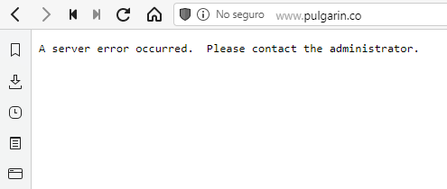

# Analisis de la situacion

## Tabla de contenidos

- [Analisis de la situacion](#analisis-de-la-situacion)
  - [Tabla de contenidos](#tabla-de-contenidos)
  - [Introduccion](#introduccion)
  - [Codigo Heredado/Legado](#codigo-heredadolegado)
    - [Estructura básica de una pagina web.](#estructura-básica-de-una-pagina-web)
    - [El archivo Index.html](#el-archivo-indexhtml)
  - [Bibliografia](#bibliografia)

## Introduccion

Cuando quise este estudiar este codigo, pense que solo seria cuestion de copiar y pegar para verlo funcionando, pero me encontré que he compartido irresponsablemente algo que no le seriviria a nadie. Muy especialmente es notable que falten grandes trozos de codigo y que no haya comentarios significativos. Por eso y como practica para mi, he decidido explorarlo y reescribirlo en vainilla javascript, agregando comentarios detallados que permitan a los interesados en estudiar el codigo aprender mas facilmente como funciona.

Mientras realizaba este analisis, tambien fui descubriendo que podia agregar nuevas cosas interesantes, que describire mas adelante, pero por el momento, el primer desafio era, el codigo en el que me basé para hacer el mio.

## Codigo Heredado/Legado

Segun la wikipedia:

> Legacy code o código heredado es código fuente relacionado con un sistema operativo o una tecnología de computación sin soporte técnico. El término también puede aplicarse a código insertado en software más moderno para integrar u ofrecer soporte a una función creada en el pasado; por ejemplo dar soporte a una interfaz en serie incluso aunque muchos sistemas modernos no tienen un puerto serial. (wikipedia,2021)

Luego de investigar con mas empeño este codigo y su autor, he encontrado un repositorio de GitHub. Si bien este codigo puede encontrarse en [aqui](https://github.com/jpulgarin/canvaslife), solo está el codigo javascript, sin el archivo index.html necesario para poder ejecutar la practica. en el mismo repositorio es posible encontrar un enlace a un servidor actualmente inactivo.

> Titulo: El sitio de Pulgarín esta muerto desde quien sabe cuando

> 
> **Fuente:** Elaboración propia

Por esta razon, comenzaremos analizando las partes necesarias para la creacion de una pagina web con javascript.

### Estructura básica de una pagina web.

Una pagina web no es mas que un documento escrito con HTML.

HTML es un lenguaje de etiquetas con las que se define la estructura del documento. Se caracteriza por ser facil de interpretar, tanto por maquinas como por humanos y es el estandar para las paginas web hasta el momento. A pesar de que es un estandar, sufre cambios a lo largo del tiempo para poder agregar y quitar caracteristicas que le permitan funcionar mejor en diferentes dispositivos, por lo que un codigo muy antiguo podria no funcionar en navegadores muy modernos. 

La version mas actual de HTML es la 5 y la que uso actualmente. Publicada en el año 2014, estandarizo muchas etiquetas nuevas que hasta ese momento podrian estar limitadas solo a ciertos navegadores que las interpretaran correctamente. En este caso, la etiqueta canvas existe desde el año 2004 de la mano de Apple en su navegador Safari, y entre el año 2005 y 2006 fue adoptado por los motores de gecko y opera, obviamente dejando a internet explorer al margen de su uso [wikipedia,2021](https://en.wikipedia.org/wiki/Canvas_element)

La estructura básica de un documento HTML es la siguiente:

    <html>
        <head>

        </head>
        <body>

        </body>
        <foot>

        </foot>
    </html>

Las etiquetas se caracterizan por estar cerradas entre [parentesis angulares](https://es.wikipedia.org/wiki/Signo_mayor_que#Par%C3%A9ntesis_angulares) "<>" donde la primera palabra dentro de ellas es el nombre de la etiqueta que los identifica. las palabras que se agreguen a la etiqueta seran considerados atributos, por ejemplo \<html lang='es'> donde el par "lang='es'"  permite al navegador determinar el idioma del documento.

Las etiquetas html tienen una jerarquia, donde cada elemento puede contener otros elementos. para eso, cada etiqueta que abre, debe cerrar con otra con el mismo nombre, pero usando una barra diagonal antes de el. por ejemplo \</html>

Hay mas cosas para abarcar sobre html, especialmente sobre la [web semantica](https://es.wikipedia.org/wiki/Web_sem%C3%A1ntica), la cual es una buena practica para todo tipo de paginas web si quieren ser lo mas accesibles posible, pero por ahora nos vamos a concentrar en la reconstruccion del codigo que nos interesa.

### El archivo Index.html

El punto de inicio de todo sitio web es el archivo index.html, aunque esto puede cambiar de acuerdo al servidor. En realidad el archivo puede tener cualquier nombre siempre y cuando se comience a navegar por el, pues es quien contiene los enlaces iniciales para la primera navegacion.

Dado que carecemos de un archivo html del cual partir, construiremos uno propio, sin grandes pretenciones para ver nuestro codigo funcionar.

    <html>
        <head>
        </head>
        <body>
        </body>
    </html>

Hay que recordar que los documentos html se cargan en la memoria haciendo un barrido desde el principio hasta el final del mismo, por lo que cada etiqueta solo tendra disponible en la memoria del dispositivo, solo lo que haya sido cargado hasta el momento en el que ella sea cargada. por lo que, por ejemplo, si hay elementos con estilos css en la etiqueta body y los archivos CSS no han sido cargados todavia, apareceran sin formato alguno. De la misma forma, el codigo javascript no podra acceder a etiquetas que no existan hasta el momento en el que ellas sean cargadas.

Por esta razon, cualquier script que se desee ejecutar, deberia ser cargado hasta el final del documento;

    <html>
        ...
        <script src="...">
    </html>

O en su defecto, utilizar un metodo onLoad en javascript que permita esperar a que se cargue todo el documento antes de intentar acceder al mismo.

## Bibliografia

[Código Heredado(2021), Obtenido de la wikipedia](https://es.wikipedia.org/wiki/C%C3%B3digo_heredado)

[Canvas Element(2021), Obtenido de la wikipedia](https://en.wikipedia.org/wiki/Canvas_element)